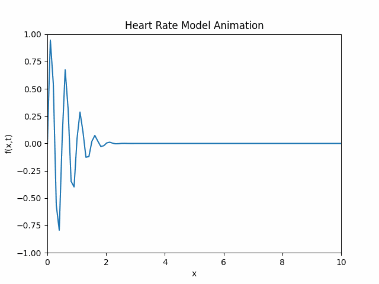

Let's solve Exercise 1 by explaining the implementation step by step.

## Exercise 1 Analysis
The exercise requires us to:
1. Visualize and animate the function f(x,t) = e^(-(x-3t)²) * sin(4π(x-t))
2. Create animation for x ∈ [0,10] and t ∈ [0,3]
3. Save it as a GIF file

## Implementation

Let's create two files:

1. First, let's create `animation.py` to define our function and animator:

```python:TP2/engine001/animation/animation.py
import numpy as np
import matplotlib.pyplot as plt
from matplotlib.animation import FuncAnimation
from typing import List
import os


def f(x: np.array, t: np.array):
    """Define the f function
    Args:
        x: np.array - position values
        t: np.array - time value
    Return:
        The heart rate model function: e^(-(x-3t)²) * sin(4π(x-t))
    """
    return np.exp(-(x - 3*t)**2) * np.sin(4*np.pi*(x - t))

def animator(x: List, t: List, path: str, f: f) -> None:
    """
    Creates and saves an animation of the function f(x,t)
    Args:
        x: List containing [x_min, x_max]
        t: List containing [t_min, t_max]
        path: String path where to save the animation
        f: Function to animate
    """
    # Define x_min and x_max from x 
    x_min, x_max = x[0], x[1]

    # Define t_min and t_max from t
    t_min, t_max = t[0], t[1]

    # Generate 100 values between x_min and x_max
    X = np.linspace(x_min, x_max, 100)

    # Generate 100 values between t_min and t_max
    t_values = np.linspace(t_min, t_max, 100)

    fig, axis = plt.subplots()

    axis.set_xlim([x_min, x_max])
    axis.set_ylim([-1, 1])

    # Add title
    axis.set_title("Heart Rate Model Animation")

    # Add y_label
    axis.set_ylabel("f(x,t)")

    # Add x_label
    axis.set_xlabel("x")

    animated_plot, = axis.plot([], [])

    def update_data(frame):
        """Define the update data function
        Args: 
            frame: int - current frame number
        Returns:
            Tuple containing the updated plot
        """
        t = t_values[frame]

        # For each t, calculate the Y with respect to X
        Y = f(X, t)

        animated_plot.set_data(X, Y)
        return animated_plot,

    animation = FuncAnimation(fig=fig, func=update_data, frames=len(t_values), 
                            interval=25, repeat=True)

    # Create directory if it doesn't exist (make data)
    os.makedirs(os.path.dirname(path), exist_ok=True)

    # Save the render using the path
    animation.save(path, writer='pillow')

    plt.show()
```

2. The main file you already have looks good:

```python:TP2/engine001/main.py
from animation import (f , animator)

def main():
    animator(x = [0,10], t = [0,3], path = "data/animation.gif", f = f)

if __name__=="__main__":
    main()
```


## Explanation of the Implementation

### The Function f(x,t)
- The function models a patient's heart rate over time
- It combines two mathematical components:
  1. `exp(-(x-3t)²)`: A Gaussian envelope that moves with velocity 3
  2. `sin(4π(x-t))`: A sinusoidal wave moving with velocity 1

### The Animator Function
1. **Setup**:
   - Creates a matplotlib figure and axis
   - Generates smooth x points using `np.linspace`
   - Sets up axis limits, labels, and title

2. **Animation Functions**:
   - `init()`: Initializes an empty line
   - `animate(frame)`: Updates the line for each frame
   - Uses 51 frames for smooth animation
   - Interval of 100ms between frames

3. **Output**:
   - Saves the animation as a GIF using the pillow writer

### How to Run
1. Make sure you have the required libraries:
```bash
pip install numpy matplotlib
```

2. Run the main.py file:
```bash
cd TP2/engine001
python main.py
```

Result animation:



This will create an animation.gif file in the data directory showing the wave function evolving over time, representing the patient's heart rate model.

The animation will show:
- A wave packet moving from left to right
- The amplitude modulated by the Gaussian envelope
- Smooth transition between frames
- Total duration of 3 seconds as specified in the time range

The resulting animation will help visualize how the heart rate model changes over both position (x) and time (t).
