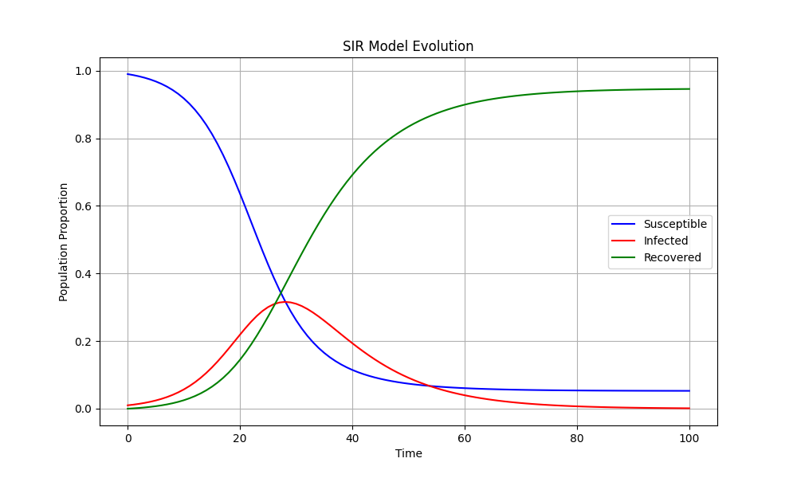

Let's implement Exercise 3 (Engine003) - the SIR Model for virus propagation. Let's break it down and implement each part.

1. First, let's implement the SIR model function:

```python:TP2/engine003/sir/sir.py
import numpy as np
import matplotlib.pyplot as plt
from typing import List, Tuple, Union
from config import max_time, beta, gamma

def sir(S: float, I: float, R: float, time: int, sir_values: List[Tuple[float, float, float]]) -> None:
    """
    Recursive implementation of SIR model
    Args:
        S: proportion of susceptible population
        I: proportion of infected population
        R: proportion of recovered population
        time: current simulation time
        sir_values: list to store simulation values
    """
    # Base case: if max time reached or no more infected
    if time >= max_time or I <= 0:
        return
    
    # Calculate changes using SIR equations
    dS = -beta * S * I
    dI = beta * S * I - gamma * I
    dR = gamma * I
    
    # Update values
    new_S = S + dS
    new_I = I + dI
    new_R = R + dR
    
    # Store new values
    sir_values.append((new_S, new_I, new_R))
    
    # Recursive call with updated values
    sir(new_S, new_I, new_R, time + 1, sir_values)

def visualize(time: np.array, sir_values: np.array) -> None:
    """
    Visualize SIR model evolution
    Args:
        time: array of time points
        sir_values: array of (S,I,R) values at each time point
    """
    plt.figure(figsize=(10, 6))
    
    # Plot each population
    plt.plot(time, sir_values[:, 0], 'b-', label='Susceptible')
    plt.plot(time, sir_values[:, 1], 'r-', label='Infected')
    plt.plot(time, sir_values[:, 2], 'g-', label='Recovered')
    
    # Add labels and title
    plt.xlabel('Time')
    plt.ylabel('Population Proportion')
    plt.title('SIR Model Evolution')
    plt.legend()
    plt.grid(True)
    
    # Save the plot
    plt.savefig('data/sir_model.png')
    plt.show()
```

The main file is already correctly structured (reference to main.py):
```python
startLine: 1
endLine: 25
```

The configuration file is also correctly set up (reference to config.py):
```python
startLine: 1
endLine: 7
```

### Explanation of the Implementation:

1. **SIR Function**:
   - Takes current S, I, R values and updates them using the differential equations
   - Uses recursive approach to simulate time evolution
   - Stops when either:
     - Maximum time is reached
     - No more infected population (I ≤ 0)
   - Uses the equations:
     - dS/dt = -β⋅S⋅I
     - dI/dt = β⋅S⋅I - γ⋅I
     - dR/dt = γ⋅I

2. **Visualization Function**:
   - Creates a plot showing evolution of all three populations
   - Uses different colors for each population:
     - Blue for Susceptible
     - Red for Infected
     - Green for Recovered
   - Includes grid, legend, and proper labels

3. **Parameters** (from config.py):
   - β (beta) = 0.3 (transmission rate)
   - γ (gamma) = 0.1 (recovery rate)
   - Initial conditions:
     - S₀ = 0.99 (99% susceptible)
     - I₀ = 0.01 (1% infected)
     - R₀ = 0.0 (0% recovered)

To run the simulation:
```bash
cd TP2/engine003
python main.py
```

Result image: 


This will:
1. Run the SIR model simulation
2. Generate a visualization of the population evolution
3. Save the plot as 'sir_model.png' in the data directory
4. Display the plot

The simulation shows how:
- Susceptible population decreases as people get infected
- Infected population rises and then falls
- Recovered population gradually increases
- All curves follow typical epidemic behavior


